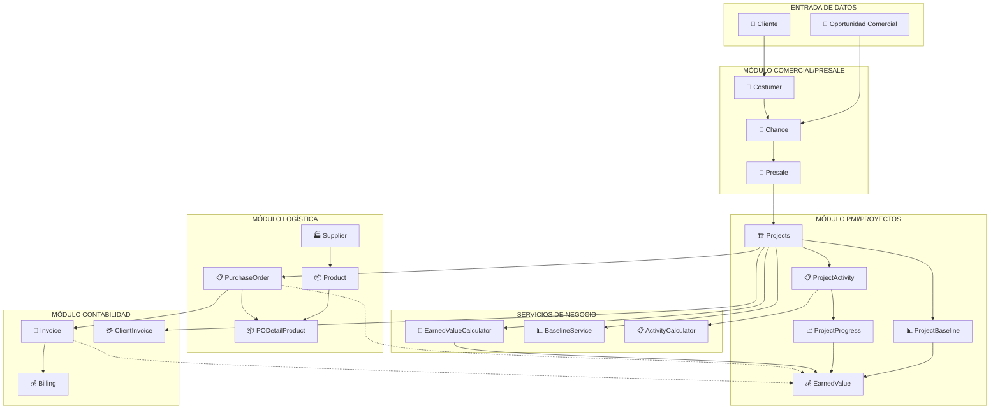
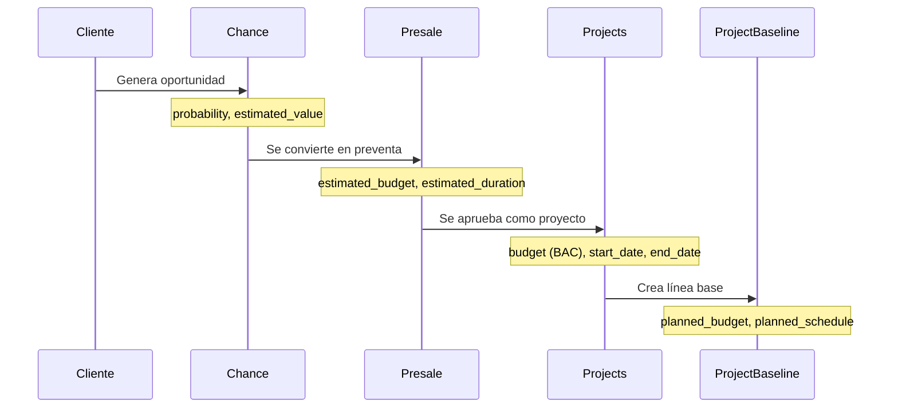
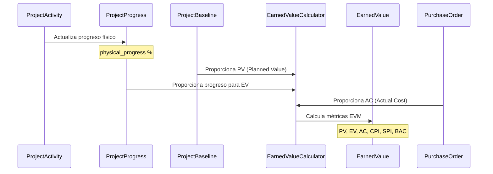
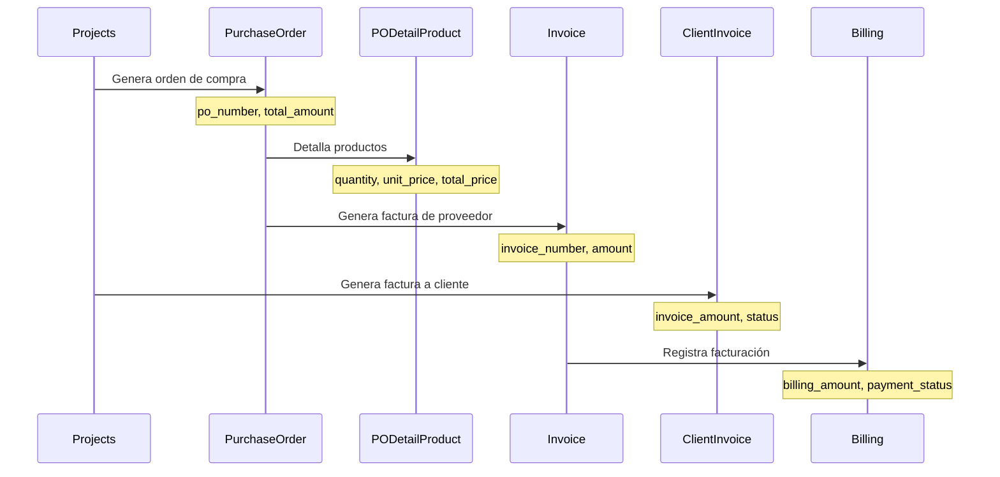
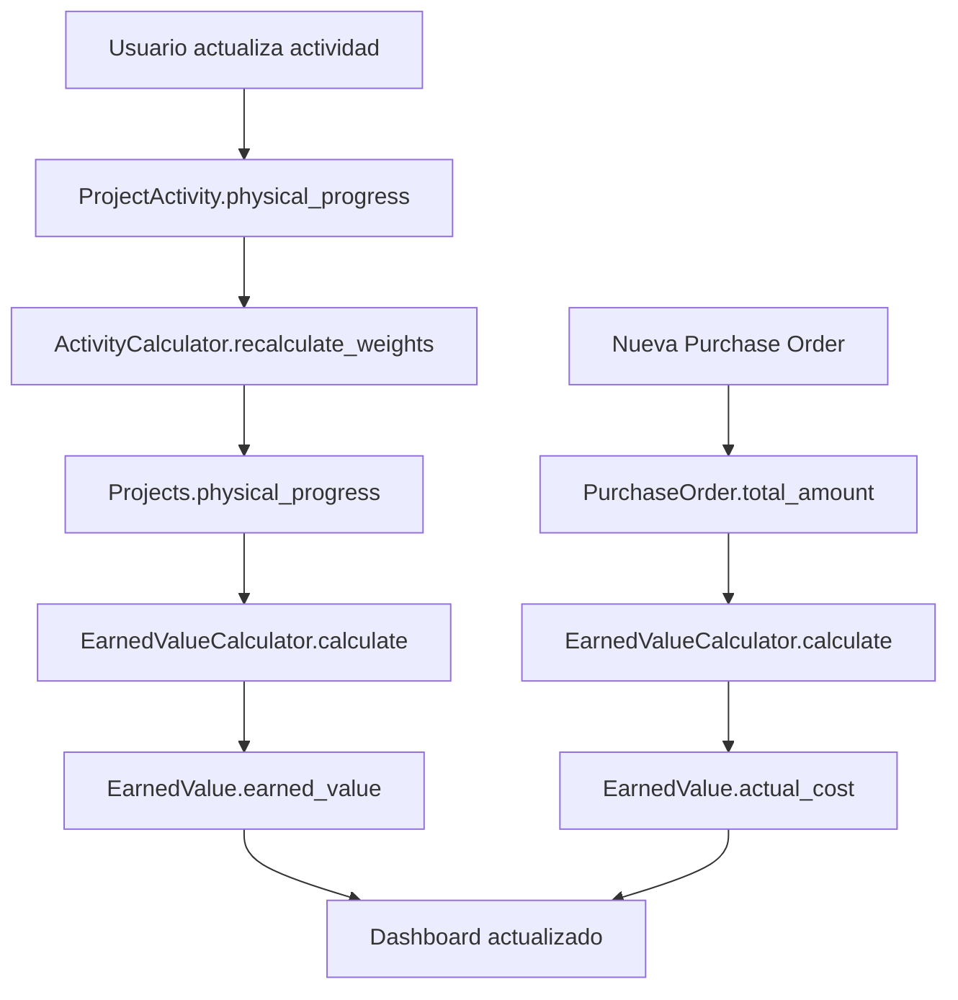
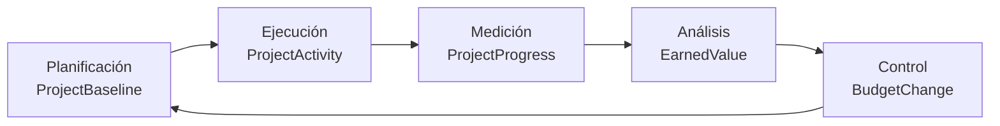
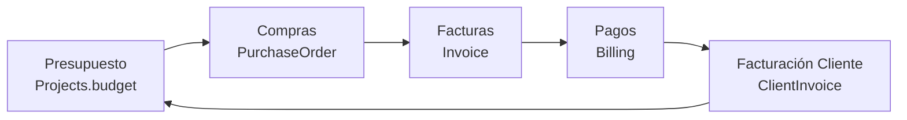

# 🔄 DIAGRAMA DE FLUJO DE DATOS - PROYECTO EYL

## 🏗️ ARQUITECTURA DE FLUJO GENERAL



## 📊 FLUJOS DE DATOS DETALLADOS

### 1. **FLUJO COMERCIAL → PMI**



**Datos Transferidos:**
- `Chance.estimated_value` → `Presale.estimated_budget`
- `Presale.estimated_budget` → `Projects.budget` (BAC)
- `Presale.estimated_duration` → `Projects.estimated_duration`
- `Projects.budget` → `ProjectBaseline.planned_budget`

---

### 2. **FLUJO PMI → EVM CALCULATION**



**Fórmulas EVM Aplicadas:**
- `PV = ProjectBaseline.planned_budget * % tiempo transcurrido`
- `EV = Projects.budget * ProjectActivity.physical_progress`
- `AC = Σ(PurchaseOrder.total_amount)`
- `CPI = EV / AC`
- `SPI = EV / PV`

---

### 3. **FLUJO LOGÍSTICA → CONTABILIDAD**



**Datos de Control Financiero:**
- `PODetailProduct.total_price` → `PurchaseOrder.total_amount`
- `PurchaseOrder.total_amount` → `Invoice.amount`
- `Projects.budget` → `ClientInvoice.invoice_amount`
- `Invoice.amount` → `Billing.billing_amount`

---

### 4. **FLUJO DE ACTUALIZACIÓN DE PROGRESO**



---

## 🔄 CICLOS DE RETROALIMENTACIÓN

### **Ciclo EVM (Earned Value Management)**


### **Ciclo Financiero**


---

## 📈 MÉTRICAS Y KPIS CALCULADOS

### **Métricas EVM Principales**
```python
# Calculadas por EarnedValueCalculator
PV = planned_value          # Valor Planificado
EV = earned_value          # Valor Ganado  
AC = actual_cost           # Costo Real
BAC = budget_at_completion # Presupuesto al Completar

# Índices de Performance
CPI = EV / AC             # Cost Performance Index
SPI = EV / PV             # Schedule Performance Index

# Proyecciones
EAC = BAC / CPI           # Estimate at Completion
ETC = EAC - AC            # Estimate to Complete
VAC = BAC - EAC           # Variance at Completion
```

### **Métricas de Progreso**
```python
# Calculadas por ActivityCalculator
physical_progress = Σ(activity.physical_progress * activity.weight)
schedule_variance = EV - PV
cost_variance = EV - AC
```

---

## 🎯 PUNTOS DE INTEGRACIÓN CRÍTICOS

### **1. Sincronización Presale → Projects**
- **Trigger**: Aprobación de preventa
- **Datos**: `estimated_budget`, `estimated_duration`, `description`
- **Validación**: Budget > 0, fechas válidas

### **2. Actualización Projects → EVM**
- **Trigger**: Cambio en `physical_progress` o nueva `PurchaseOrder`
- **Proceso**: Recálculo automático de métricas EVM
- **Persistencia**: `EarnedValue` model

### **3. Control PurchaseOrder → AC**
- **Trigger**: Creación/modificación de OC
- **Impacto**: Actualización de `actual_cost` en EVM
- **Validación**: Verificación de presupuesto disponible

### **4. Facturación Projects → ClientInvoice**
- **Trigger**: Hito de facturación o % completado
- **Datos**: Monto basado en `earned_value`
- **Control**: Estado de pagos y cobranza

---

## ⚡ EVENTOS Y TRIGGERS DEL SISTEMA

### **Eventos Automáticos**
```python
# Cuando se actualiza physical_progress
ProjectActivity.save() → ActivityCalculator.recalculate() → EarnedValue.update()

# Cuando se crea/modifica PurchaseOrder  
PurchaseOrder.save() → EarnedValueCalculator.update_ac() → EarnedValue.update()

# Cuando se cambia estado de Invoice
Invoice.save() → Billing.update_status() → Cash_flow.update()
```

### **Eventos Manuales**
```python
# Dashboard refresh
User.click_refresh() → EarnedValueCalculator.calculate_all() → Dashboard.update()

# Baseline recalculation
User.recalculate_baseline() → BaselineService.update() → ProjectBaseline.save()

# Activity weight redistribution
User.recalculate_weights() → ActivityCalculator.redistribute() → ProjectActivity.save()
```

---

## 🔍 ANÁLISIS DE DEPENDENCIAS

### **Dependencias Fuertes (Críticas)**
- `Presale` ↔ `Projects` (OneToOne)
- `Projects` → `EarnedValue` (Cálculos EVM)
- `PurchaseOrder` → `PODetailProduct` (Integridad financiera)

### **Dependencias Débiles (Opcionales)**
- `Projects` → `ClientInvoice` (Facturación)
- `Invoice` → `Billing` (Control contable)
- `ProjectActivity` → `Hoursrecord` (Seguimiento tiempo)

### **Dependencias Calculadas (Derivadas)**
- `ProjectActivity.physical_progress` → `Projects.physical_progress`
- `PODetailProduct.total_price` → `PurchaseOrder.total_amount`
- `PurchaseOrder.total_amount` → `EarnedValue.actual_cost`

---

## 🚨 PUNTOS DE ATENCIÓN

### **Consistencia de Datos**
- ✅ Verificar que `Projects.budget` = `ProjectBaseline.planned_budget`
- ✅ Validar que `Σ(PODetailProduct.total_price)` = `PurchaseOrder.total_amount`
- ✅ Confirmar que `physical_progress` esté entre 0-100%

### **Performance**
- ⚡ Cálculos EVM pueden ser costosos con muchas actividades
- ⚡ Considerar cache para métricas frecuentemente consultadas
- ⚡ Optimizar queries N+1 en dashboard

### **Integridad Referencial**
- 🔒 `Projects` no debe eliminarse si tiene `PurchaseOrder` asociadas
- 🔒 `Supplier` no debe eliminarse si tiene `Product` activos
- 🔒 `ProjectActivity` debe mantener consistencia de pesos (suma = 100%)