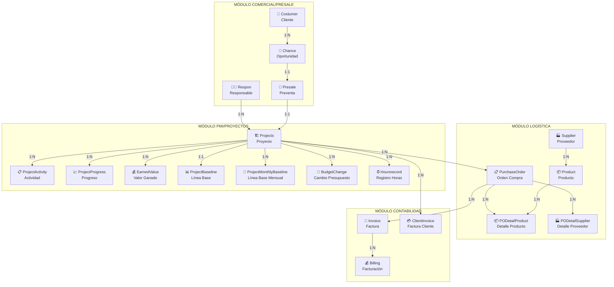
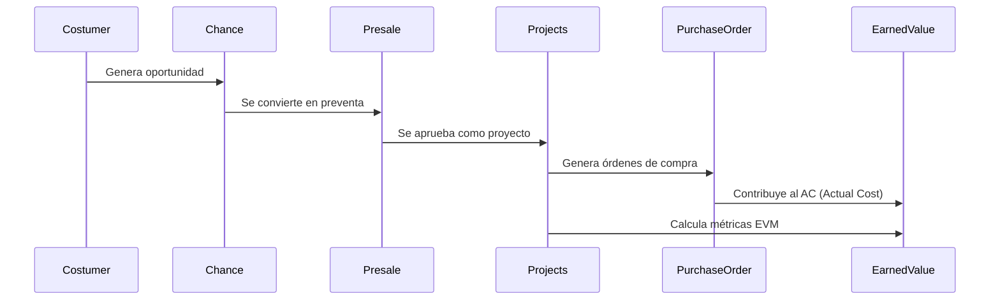

# 📊 DIAGRAMA DE RELACIONES - MODELOS DEL PROYECTO EYL

## 🏗️ ARQUITECTURA GENERAL



## 🔗 RELACIONES DETALLADAS POR MODELO

### 1. **Costumer** (Cliente)
```python
# Campos principales:
- name: CharField (Nombre del cliente)
- email: EmailField
- phone: CharField
- address: TextField

# Relaciones:
→ Chance (1:N) - Un cliente puede tener múltiples oportunidades
```

### 2. **Chance** (Oportunidad)
```python
# Campos principales:
- name: CharField
- description: TextField
- probability: DecimalField (0-100%)
- estimated_value: DecimalField
- expected_close_date: DateField
- status: CharField (CHOICES)

# Relaciones:
← Costumer (N:1) - Pertenece a un cliente
→ Presale (1:1) - Se convierte en una preventa
```

### 3. **Presale** (Preventa)
```python
# Campos principales:
- name: CharField
- description: TextField
- estimated_budget: DecimalField
- estimated_duration: IntegerField (días)
- status: CharField (CHOICES)
- created_at: DateTimeField

# Relaciones:
← Chance (1:1) - Proviene de una oportunidad
→ Projects (1:1) - Se convierte en proyecto
```

### 4. **Projects** (Proyecto)
```python
# Campos principales:
- name: CharField
- description: TextField
- start_date: DateField
- end_date: DateField
- budget: DecimalField
- status: CharField (CHOICES)
- physical_progress: DecimalField (0-100%)
- cost_center: CharField

# Relaciones:
← Presale (1:1) - Proviene de preventa
← Respon (N:1) - Tiene un responsable
→ ProjectActivity (1:N) - Contiene actividades
→ ProjectProgress (1:N) - Registros de progreso
→ EarnedValue (1:N) - Cálculos EVM
→ ProjectBaseline (1:1) - Línea base del proyecto
→ ProjectMonthlyBaseline (1:N) - Líneas base mensuales
→ BudgetChange (1:N) - Cambios de presupuesto
→ PurchaseOrder (1:N) - Órdenes de compra
→ ClientInvoice (1:N) - Facturas al cliente
→ Hoursrecord (1:N) - Registro de horas
```

### 5. **ProjectActivity** (Actividad del Proyecto)
```python
# Campos principales:
- name: CharField
- description: TextField
- planned_start: DateField
- planned_end: DateField
- actual_start: DateField
- actual_end: DateField
- physical_progress: DecimalField (0-100%)
- budget_allocated: DecimalField

# Relaciones:
← Projects (N:1) - Pertenece a un proyecto
```

### 6. **PurchaseOrder** (Orden de Compra)
```python
# Campos principales:
- po_number: CharField (único)
- issue_date: DateField
- delivery_date: DateField
- total_amount: DecimalField
- status: CharField (CHOICES)
- igv: DecimalField
- currency: CharField

# Relaciones:
← Projects (N:1) - Pertenece a un proyecto
→ PODetailProduct (1:N) - Detalles de productos
→ PODetailSupplier (1:N) - Detalles de proveedores
→ Invoice (1:N) - Facturas asociadas
```

### 7. **PODetailProduct** (Detalle Producto OC)
```python
# Campos principales:
- quantity: DecimalField
- unit_price: DecimalField
- total_price: DecimalField
- measurement_unit: CharField
- comment: TextField
- igv: DecimalField
- local_total: DecimalField

# Relaciones:
← PurchaseOrder (N:1) - Pertenece a una OC
← Product (N:1) - Referencia un producto
```

### 8. **EarnedValue** (Valor Ganado)
```python
# Campos principales:
- calculation_date: DateField
- planned_value: DecimalField (PV)
- earned_value: DecimalField (EV)
- actual_cost: DecimalField (AC)
- budget_at_completion: DecimalField (BAC)
- cpi: DecimalField (Cost Performance Index)
- spi: DecimalField (Schedule Performance Index)

# Relaciones:
← Projects (N:1) - Pertenece a un proyecto
```

## 📈 FLUJO DE DATOS PRINCIPAL



## 🎯 PUNTOS CLAVE DE INTEGRACIÓN

### **1. Flujo Comercial → PMI**
- `Costumer` → `Chance` → `Presale` → `Projects`
- Transferencia de presupuesto estimado a BAC (Budget at Completion)

### **2. Flujo PMI → Logística**
- `Projects` → `PurchaseOrder` → `PODetailProduct`
- Las OC contribuyen al AC (Actual Cost) en EVM

### **3. Flujo Logística → Contabilidad**
- `PurchaseOrder` → `Invoice` → `Billing`
- Control de facturación y pagos

### **4. Cálculos EVM**
- `ProjectActivity` → Progreso físico → EV (Earned Value)
- `PurchaseOrder` → Costos reales → AC (Actual Cost)
- `ProjectBaseline` → Planificación → PV (Planned Value)

## ⚠️ OBSERVACIONES IMPORTANTES

### **Duplicaciones Detectadas:**
- Existen dos modelos `Billing` (billing.py y billin.py)
- Revisar y consolidar

### **Estados Inconsistentes:**
- Diferentes valores de estado en `Projects.status`
- Estandarizar choices.py

### **Relaciones Críticas:**
- `Presale` ↔ `Projects`: OneToOneField bidireccional
- `Projects` ↔ `ProjectBaseline`: Relación 1:1 para línea base
- `PurchaseOrder` → `Projects`: Múltiples OC por proyecto