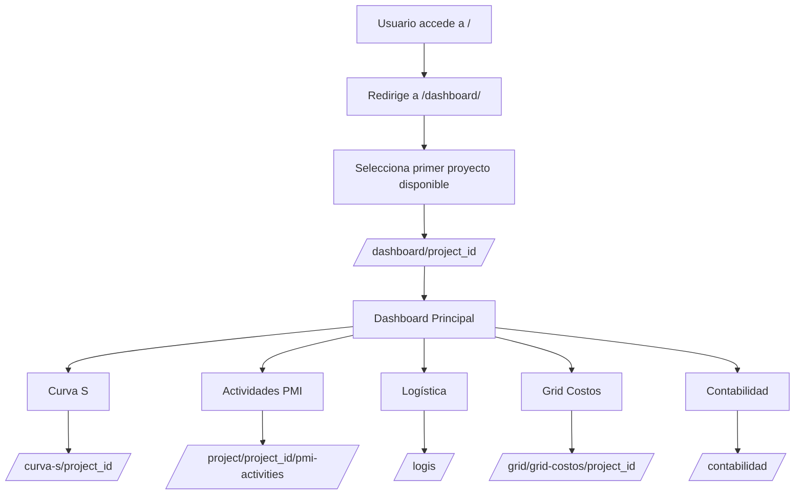

# 🗺️ MAPA COMPLETO DE RUTAS - PROYECTO EYL

## 🏠 ESTRUCTURA PRINCIPAL DE URLs

```mermaid
graph TB
    subgraph "CORE URLs (core/urls.py)"
        Root[/ → /dashboard/]
        Admin[/admin/ → Django Admin]
        Projects[/ → projects.urls]
        Contabilidad[/contabilidad/ → contabilidad.urls]
    end
    
    subgraph "PROJECTS URLs (projects/urls/__init__.py)"
        Dashboard[/dashboard/ → dashboard_view]
        CurvaS[/curva-s/ → curva_s_home]
        Activities[/activities/ → activities_home]
        Presale[/presale/ → presale.urls]
        Logis[/logis/ → logis.urls]
        Grid[/grid/ → grid.urls]
        PMI[/ → pmi.urls]
    end
```

## 📋 RUTAS DETALLADAS POR MÓDULO

### 🏠 **CORE ROUTES** (`core/urls.py`)
```python
# Rutas principales del sistema
/                           → redirect_to_dashboard()
/admin/                     → Django Admin Panel
/                          → include("projects.urls")
/contabilidad/             → include("projects.urls.contabilidad")
```

---

### 🎯 **MÓDULO PRINCIPAL** (`projects/urls/__init__.py`)

#### **Dashboard & Navegación Principal**
```python
/dashboard/                     → redirect_to_dashboard()
/dashboard/<project_id>/        → dashboard_view (name='project_dashboard')
/curva-s/                      → curva_s_home (name='curva_s_home')
/curva-s/<project_id>/         → curva_s_view (name='curva_s')
/activities/                   → redirect_to_activities()
```

#### **Gestión de Actividades PMI**
```python
/project/<project_id>/add-activity/           → add_project_activity
/activity/<activity_id>/update-units/         → update_activity_units
/activity/<activity_id>/edit/                 → edit_activity
/activity/<activity_id>/delete/               → delete_activity
/project/<project_id>/recalculate-weights/    → recalculate_weights
/api/project/<project_id>/physical-progress/  → get_physical_progress_api
```

#### **Inclusiones de Submódulos**
```python
/presale/                  → include("projects.urls.presale")
/logis/                    → include("projects.urls.logis")
/grid/                     → include("projects.urls.grid")
/                         → include("projects.urls.pmi")
```

---

### 🎯 **MÓDULO PMI** (`projects/urls/pmi.py`)

```python
# URLs específicas para Project Management Institute (PMI)
/project/<project_id>/pmi-dashboard/          → pmi_dashboard
/project/<project_id>/pmi-activities/         → pmi_activity_management
/project/<project_id>/activities/             → pmi_activity_management (alias)
/project/activity/<activity_id>/update-pmi-progress/ → update_activity_progress_pmi
/api/project/<project_id>/physical-progress/  → pmi_physical_progress_api
```

---

### 💼 **MÓDULO PRESALE** (`projects/urls/presale.py`)

```python
# Gestión de Preventas
/presale/                  → pre_sale (name='presale_list')
/presale/create/           → crear_presale (name='crear_presale')
/presale/<pk>/edit/        → presale_edit (name='presale_edit')
/presale/<pk>/delete/      → presale_delete (name='presale_delete')
```

---

### 📦 **MÓDULO LOGÍSTICA** (`projects/urls/logis.py`)

```python
# Gestión de Órdenes de Compra y Logística
/logis/                           → purchase_order_index (name='logis_index')
/logis/suppliers/                 → purchase_order_index (name='supplier_list')
/logis/products/                  → purchase_order_index (name='product_list')
/logis/create/                    → purchase_order_create
/logis/<pk>/edit/                 → purchase_order_edit
/logis/<pk>/delete/               → purchase_order_delete

# APIs de Autocompletado
/logis/autocomplete/supplier/     → autocomplete_supplier
/logis/autocomplete/product/      → autocomplete_product
```

---

### 📊 **MÓDULO GRID** (`projects/urls/grid.py`)

```python
# Grid de Costos Variables
/grid/                            → grid_principal (name='grid')
/grid/grid-costos/<proyecto_id>/  → grid_costos_variables (name='grid_costos')
/grid/excel-grid/                 → exportar_excel_grid (name='excel_grid')
/grid/dashboard/<project_id>/     → dashboard_view (name='project_dashboard')
/grid/curva-s/<project_id>/       → curva_s_view (name='curva_s')
```

---

### 💰 **MÓDULO CONTABILIDAD** (`projects/urls/contabilidad.py`)

#### **Dashboards por Rol**
```python
/contabilidad/                    → contabilidad_seleccion (name='seleccion_rol')
/contabilidad/jefe/               → contabilidad_jefe (name='jefe_dashboard')
/contabilidad/asistente/          → contabilidad_asistente (name='asistente_dashboard')
/contabilidad/dashboard/          → contabilidad_seleccion (legacy)
```

#### **Gestión de Facturas**
```python
/contabilidad/facturas-clientes/         → factura_cliente_list
/contabilidad/facturas-clientes/crear/   → factura_cliente_crear
```

#### **Flujo de Pagos**
```python
/contabilidad/factura/<factura_id>/reportar-pago/   → factura_reportar_pago
/contabilidad/factura/<factura_id>/verificar-pago/  → factura_verificar_pago
/contabilidad/pagos/                                → pagos_status
/contabilidad/aprobaciones/                         → pagos_status (alias)
```

#### **Verificación y Reportes**
```python
/contabilidad/verificacion-bancaria/         → verificacion_bancaria
/contabilidad/verificacion-bancaria/simple/  → verificacion_bancaria_simple
/contabilidad/reportes/                      → reportes_contables
```

---

## 🔄 FLUJO DE NAVEGACIÓN PRINCIPAL



## 🎯 ENDPOINTS CLAVE POR FUNCIONALIDAD

### **📊 Dashboard & Métricas EVM**
- `GET /dashboard/` → Redirige al primer proyecto
- `GET /dashboard/<project_id>/` → Dashboard específico del proyecto
- `GET /api/project/<project_id>/physical-progress/` → API progreso físico

### **📈 Curva S & Análisis**
- `GET /curva-s/` → Página principal Curva S
- `GET /curva-s/<project_id>/` → Curva S específica del proyecto

### **📋 Gestión de Actividades**
- `GET /project/<project_id>/pmi-activities/` → Lista de actividades
- `POST /project/<project_id>/add-activity/` → Crear nueva actividad
- `PUT /activity/<activity_id>/update-units/` → Actualizar unidades
- `DELETE /activity/<activity_id>/delete/` → Eliminar actividad

### **💼 Preventas**
- `GET /presale/` → Lista de preventas
- `POST /presale/create/` → Crear preventa
- `PUT /presale/<pk>/edit/` → Editar preventa

### **📦 Logística**
- `GET /logis/` → Lista de órdenes de compra
- `POST /logis/create/` → Crear orden de compra
- `GET /logis/autocomplete/supplier/` → Autocompletado proveedores

### **💰 Contabilidad**
- `GET /contabilidad/` → Selección de rol
- `GET /contabilidad/facturas-clientes/` → Lista facturas
- `POST /contabilidad/factura/<id>/reportar-pago/` → Reportar pago

## ⚠️ OBSERVACIONES IMPORTANTES

### **🔄 Redirecciones Automáticas**
- `/` → `/dashboard/` → `/dashboard/<primer_proyecto>/`
- `/activities/` → `/project/<primer_proyecto>/pmi-activities/`
- `/grid/` → `/grid/grid-costos/<primer_proyecto>/`

### **🔗 URLs Duplicadas/Alias**
- `project_dashboard` aparece en múltiples archivos de URLs
- `physical_progress_api` tiene implementaciones en PMI y main
- Múltiples rutas para `factura_cliente_crear`

### **📱 APIs Disponibles**
- `/api/project/<project_id>/physical-progress/` → Progreso físico
- `/logis/autocomplete/supplier/` → Autocompletado proveedores
- `/logis/autocomplete/product/` → Autocompletado productos

### **🎨 Namespaces**
- `contabilidad:` → Para URLs del módulo contabilidad
- Sin namespace para el resto de módulos

## 🚀 PUNTOS DE ENTRADA PRINCIPALES

1. **Dashboard Principal**: `/dashboard/`
2. **Gestión PMI**: `/project/<id>/pmi-activities/`
3. **Logística**: `/logis/`
4. **Preventas**: `/presale/`
5. **Contabilidad**: `/contabilidad/`
6. **Admin**: `/admin/`