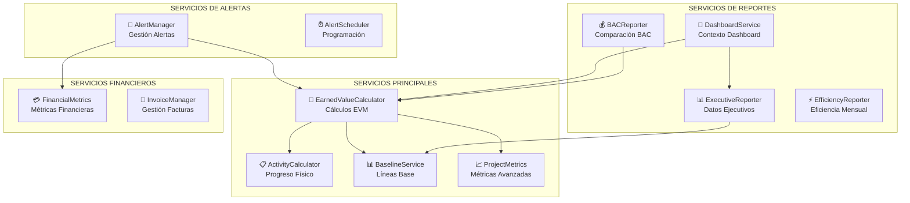
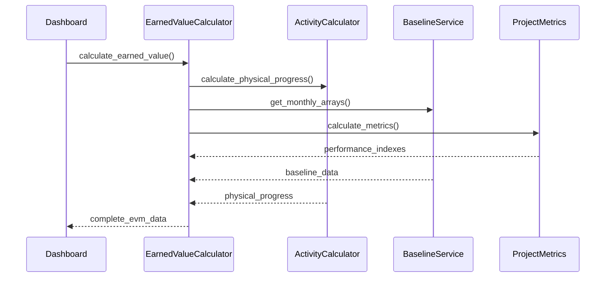
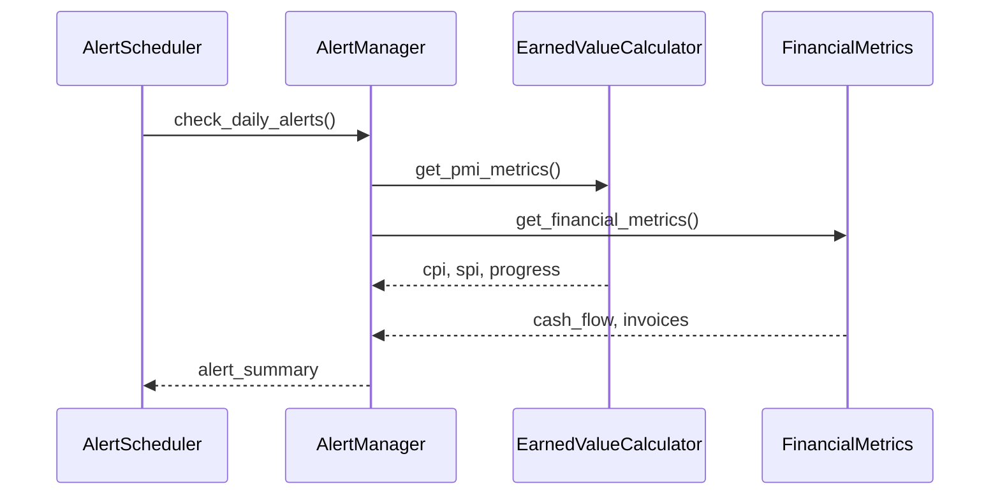

# 🔧 ANÁLISIS DE SERVICIOS DE NEGOCIO - PROYECTO EYL

## 🏗️ ARQUITECTURA DE SERVICIOS



## 🧮 SERVICIOS PRINCIPALES

### **1. EarnedValueCalculator** 
**Archivo**: `services/earned_value/calculator.py`

**Propósito**: Servicio principal para cálculos EVM según estándares PMI

**Métodos Clave**:
```python
@staticmethod
def calculate_earned_value(project_id):
    """
    Calcula datos EVM completos:
    - BAC (Budget at Completion)
    - PV (Planned Value) 
    - EV (Earned Value)
    - AC (Actual Cost)
    - CPI, SPI (Performance Indexes)
    """

@staticmethod
def get_bac_real(project):
    """
    Calcula BAC vigente:
    BAC = Presale.total_cost + BudgetChange.amount
    """

@staticmethod
def calculate_actual_cost_real(project, duration):
    """
    Calcula AC desde PODetailProduct.local_total
    Serie mensual acumulada
    """

@staticmethod
def get_pmi_dashboard_data(project_id):
    """
    Datos completos para dashboard PMI
    Integra con ActivityCalculator
    """
```

**Dependencias**:
- `ActivityCalculator` → Progreso físico
- `BaselineService` → Líneas base persistentes
- `Models`: Projects, PurchaseOrder, PODetailProduct, BudgetChange

---

### **2. ActivityCalculator**
**Archivo**: `services/earned_value/activity_calculator.py`

**Propósito**: Cálculos especializados de progreso físico y pesos de actividades

**Métodos Clave**:
```python
@staticmethod
def calculate_activity_weights(project):
    """
    Calcula pesos automáticos:
    Peso = (Complejidad + Esfuerzo + Impacto) / Total * 100
    """

@staticmethod
def calculate_physical_progress(project):
    """
    Progreso físico ponderado:
    Σ(actividad.progress * actividad.weight)
    """

@staticmethod
def get_physical_progress_detail(project_id):
    """
    Detalle completo de progreso por actividad
    Para dashboard y reportes
    """

@staticmethod
def recalculate_all_weights(project):
    """
    Redistribuye pesos para que sumen 100%
    Mantiene proporciones relativas
    """
```

**Dependencias**:
- `Models`: Projects, ProjectActivity

---

### **3. BaselineService**
**Archivo**: `services/baseline_service.py`

**Propósito**: Gestión de líneas base persistentes para proyectos

**Métodos Clave**:
```python
@staticmethod
def ensure_baseline(project_id):
    """
    Crea/actualiza baseline del proyecto
    Genera ProjectBaseline + ProjectMonthlyBaseline
    """

@staticmethod
def get_monthly_arrays(project_id):
    """
    Retorna arrays mensuales:
    - months, labels, pv, ev, ac, billing, progress
    """

@staticmethod
def recalculate_pv_from_progress(project_id):
    """
    Recalcula PV basado en % progreso planificado
    PV = BAC * (progress_planned / 100)
    """

@staticmethod
def _linear_series(total, months):
    """
    Genera serie lineal acumulada
    Para distribución uniforme en el tiempo
    """
```

**Dependencias**:
- `Models`: Projects, ProjectBaseline, ProjectMonthlyBaseline

---

### **4. ProjectMetrics**
**Archivo**: `services/earned_value/metrics.py`

**Propósito**: Métricas avanzadas y análisis de desempeño

**Métodos Clave**:
```python
@staticmethod
def calculate_performance_indexes(project_id):
    """
    Índices avanzados PMI:
    - TCP_I (To Complete Performance Index)
    - Cost/Schedule Ratios
    - Niveles de eficiencia
    """

@staticmethod
def calculate_risk_metrics(project_id):
    """
    Evaluación de riesgos:
    - Riesgo de costos, cronograma, general
    - Alertas automáticas
    """

@staticmethod
def calculate_forecast_metrics(project_id):
    """
    Proyecciones:
    - EAC (Estimate at Completion)
    - ETC (Estimate to Complete)
    - Días estimados para completar
    """

@staticmethod
def get_comprehensive_metrics(project_id):
    """
    Métricas completas combinadas
    Para reportes ejecutivos
    """
```

---

## 📊 SERVICIOS DE REPORTES

### **5. ExecutiveReporter**
**Archivo**: `services/excel_reports/executive_reporter.py`

**Propósito**: Datos ejecutivos para reportes Excel

```python
@staticmethod
def generate_executive_data(project_id):
    """
    Datos ejecutivos:
    - BAC presupuestado vs real
    - Total gastado (AC)
    - Margen bruto
    - Eficiencia general
    """
```

### **6. BACReporter**
**Archivo**: `services/excel_reports/bac_reporter.py`

**Propósito**: Comparación de presupuestos

```python
@staticmethod
def get_bac_comparison_data(project_id):
    """
    Compara:
    - BAC Planeado (Presale.total_cost)
    - BAC Real (con cambios de presupuesto)
    """
```

### **7. EfficiencyReporter**
**Archivo**: `services/excel_reports/efficiency_reporter.py`

**Propósito**: Análisis de eficiencia mensual

```python
@staticmethod
def get_monthly_efficiency(project_id):
    """
    Eficiencia mensual:
    (Facturación / Costos) * 100
    """
```

### **8. DashboardService**
**Archivo**: `services/excel_reports/dashboard_service.py`

**Propósito**: Contexto completo para dashboard

```python
@staticmethod
def get_dashboard_context(project_id):
    """
    Contexto completo:
    - Datos Curva S
    - Métricas EVM
    - Datos ejecutivos
    - Formateo para templates
    """
```

---

## 🚨 SERVICIOS DE ALERTAS

### **9. AlertManager**
**Archivo**: `services/alert_system/alert_manager.py`

**Propósito**: Sistema de alertas automáticas

**Métodos Clave**:
```python
@staticmethod
def check_pmi_alerts(project_id):
    """
    Alertas PMI:
    - CPI < 0.9 → Alerta costos
    - SPI < 0.8 → Alerta cronograma
    - Progreso físico bajo
    """

@staticmethod
def check_financial_alerts(project_id):
    """
    Alertas financieras:
    - Flujo de caja
    - Facturas vencidas
    - Límites presupuestarios
    """

@staticmethod
def get_all_alerts(project_id):
    """
    Todas las alertas del proyecto
    Combinadas por prioridad
    """
```

### **10. AlertScheduler**
**Archivo**: `services/alert_system/alert_scheduler.py`

**Propósito**: Programación de verificaciones

```python
@staticmethod
def check_daily_alerts():
    """
    Verificación diaria automática
    Para todos los proyectos activos
    """

@staticmethod
def run_scheduled_checks():
    """
    Ejecuta verificaciones programadas
    Punto de entrada para cron jobs
    """
```

---

## 💳 SERVICIOS FINANCIEROS

### **11. FinancialMetricsCalculator**
**Archivo**: `services/invoice_management/financial_metrics.py`

**Propósito**: Métricas financieras del proyecto

```python
@staticmethod
def calculate_project_financials(project_id):
    """
    Métricas financieras:
    - Cash flow
    - Cuentas por cobrar/pagar
    - Rentabilidad
    """
```

### **12. InvoiceManager**
**Archivo**: `services/invoice_management/invoice_manager.py`

**Propósito**: Gestión de facturas y pagos

```python
@staticmethod
def process_invoice_payments(project_id):
    """
    Procesa pagos de facturas
    Actualiza estados y flujos
    """
```

---

## 🔄 INTERCONEXIONES ENTRE SERVICIOS

### **Flujo Principal EVM**


### **Flujo de Alertas**


---

## 📈 MÉTRICAS Y CÁLCULOS CLAVE

### **Fórmulas EVM Implementadas**
```python
# En EarnedValueCalculator
BAC = Presale.total_cost + Σ(BudgetChange.amount)
PV = BAC * (tiempo_transcurrido / duración_total)
EV = BAC * (physical_progress / 100)
AC = Σ(PODetailProduct.local_total)

# Índices de Performance
CPI = EV / AC  # Cost Performance Index
SPI = EV / PV  # Schedule Performance Index

# Proyecciones
EAC = BAC / CPI  # Estimate at Completion
ETC = EAC - AC   # Estimate to Complete
VAC = BAC - EAC  # Variance at Completion
```

### **Cálculo de Progreso Físico**
```python
# En ActivityCalculator
physical_progress = Σ(activity.physical_progress * activity.weight)

# Peso automático por actividad
weight = (complexity + effort + impact) / total_points * 100
```

### **Alertas Automáticas**
```python
# En AlertManager
if CPI < 0.9: → ALERTA_COSTOS_ALTA
if SPI < 0.8: → ALERTA_CRONOGRAMA_ALTA
if physical_progress < 30: → ALERTA_PROGRESO_MEDIA
```

---

## 🎯 PUNTOS DE INTEGRACIÓN

### **1. Dashboard Principal**
- `DashboardService.get_dashboard_context()`
- Integra: EVM + Executive + Baseline
- Formato: JSON para JavaScript

### **2. API Endpoints**
- `/api/project/<id>/physical-progress/` → ActivityCalculator
- Datos en tiempo real para frontend

### **3. Reportes Excel**
- ExecutiveReporter, BACReporter, EfficiencyReporter
- Datos formateados para exportación

### **4. Sistema de Alertas**
- AlertManager + AlertScheduler
- Verificaciones automáticas diarias

---

## ⚡ OPTIMIZACIONES Y PERFORMANCE

### **Caching Implementado**
- Métricas EVM se calculan bajo demanda
- BaselineService persiste datos mensuales
- ActivityCalculator cachea pesos calculados

### **Queries Optimizadas**
- `select_related()` para relaciones FK
- `prefetch_related()` para relaciones M2M
- Agregaciones en base de datos

### **Puntos de Mejora**
- ✅ Implementar cache Redis para métricas frecuentes
- ✅ Optimizar queries N+1 en dashboard
- ✅ Paralelizar cálculos de múltiples proyectos

---

## 🔍 ANÁLISIS DE DEPENDENCIAS

### **Dependencias Críticas**
```python
EarnedValueCalculator → ActivityCalculator (progreso físico)
EarnedValueCalculator → BaselineService (líneas base)
AlertManager → EarnedValueCalculator (métricas PMI)
DashboardService → EarnedValueCalculator (datos principales)
```

### **Dependencias Opcionales**
```python
ExecutiveReporter → BaselineService (fallback datos)
EfficiencyReporter → BaselineService (datos históricos)
ProjectMetrics → EarnedValueCalculator (métricas base)
```

### **Servicios Independientes**
```python
AlertScheduler (solo coordina)
BACReporter (solo compara presupuestos)
InvoiceManager (gestión facturas)
```

---

## 🚨 PUNTOS DE ATENCIÓN

### **Consistencia de Datos**
- ✅ Verificar que ActivityCalculator y EVM usen misma fuente
- ✅ Validar que BaselineService mantenga coherencia temporal
- ✅ Confirmar que AlertManager use umbrales correctos

### **Performance**
- ⚡ EarnedValueCalculator puede ser costoso con muchas OCs
- ⚡ ActivityCalculator optimizado para recálculos frecuentes
- ⚡ BaselineService persiste para evitar recálculos

### **Mantenibilidad**
- 🔧 Servicios bien separados por responsabilidad
- 🔧 Interfaces claras entre componentes
- 🔧 Logging implementado para debugging

### **Escalabilidad**
- 📈 Servicios stateless (sin estado interno)
- 📈 Cálculos pueden paralelizarse
- 📈 Cache puede implementarse fácilmente